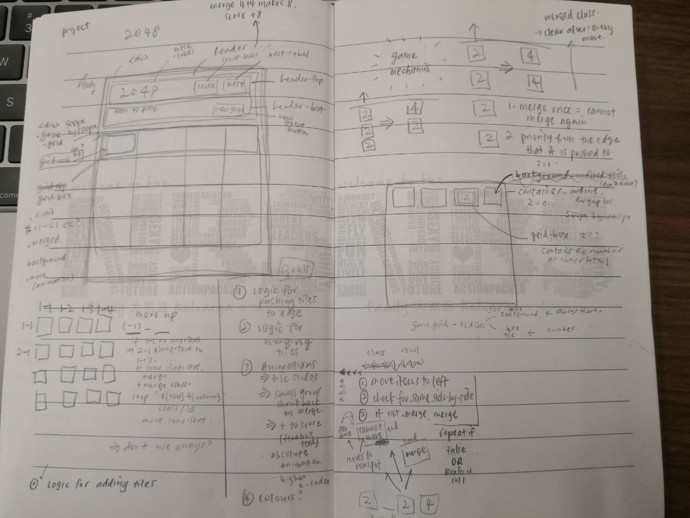

# to o for ate

a 2048 replica :D

## how to play

Use arrow keys to move the tiles. Tiles with the same number merge into one when they touch. Add them up to reach 2048!

# technologies used

This game was written in HTML, CSS, and JavaScript.

## general approach

1. Visual pencil and paper sketch of how the screen should look

2. Splitting the visual sketch into divisions and class names - with DOM manipulation and CSS styling in mind

3. Writing the html out

4. Styling each html element

5. Writing game logic on js

  i.    Creating const variables using DOM selectors on relevant html elements 

  ii.   createNewtile() for tile creation 

  iii.  moveBox(boxFrom, boxTo) that allows tiles to check adjacent tiles for merges/ movement/ neither

  iv.   push(), that loops moveBox() to move multiple tiles in the direction specified

6. clean up

  i.    Linking event listeners to functions

  ii.   Updating of score

  iii.  Allowing restarting of the game

## sketches of wireframes

## major hurdles

The starting hurdle was very big... game logic played a huge part to how I would write the `
`s in the game grid of the html code. The html code changed multiple times while I was brainstorming different methods of how to move the tiles around. After overcoming this hurdle, most of the project up to 90% of its completion was pretty straightforward.

... Until I tried to animate the sliding of the tiles. I still haven't found a working method to do this :(

